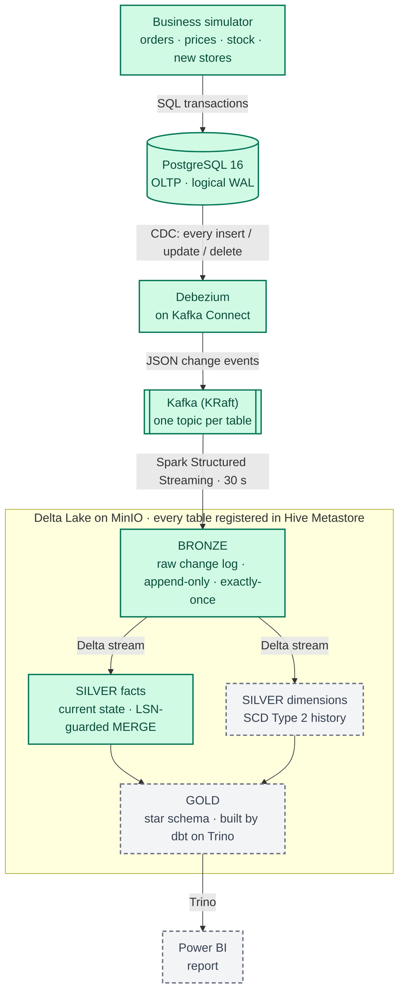

# fmcg-realtime-lakehouse

A near-real-time lakehouse for an FMCG distributor, built end to end on open-source components and run entirely with Docker Compose.

Orders, price changes, store tier upgrades and stock movements happen in a PostgreSQL OLTP database. Every change is captured with **Debezium CDC**, streamed through **Kafka**, landed by **Spark Structured Streaming** into **Delta Lake** on **MinIO**, modelled into current-state facts and **SCD Type 2** dimensions, turned into a star schema by **dbt on Trino**, and reported in **Power BI**. A change in Postgres reaches Silver in about a minute.

**What this project shows**

- CDC from a live OLTP system, including deletes, ordered by commit LSN rather than wall-clock time
- A medallion architecture where Bronze is a replayable change log and Silver can be rebuilt without touching Kafka
- Exactly-once, restart-safe streaming: checkpoints, idempotent Delta writes and an LSN-guarded MERGE, proven with hard-kill tests
- SCD Type 2 maintained in streaming, correct even when one micro-batch holds several changes to the same key *(in progress)*
- Point-in-time joins in Gold, so revenue reflects the price and store tier *at the time of sale* *(planned)*
- Reproducible everything: pinned images, one uv lockfile, deterministic seed data, one-command startup

## Status

The pipeline runs end to end from Postgres to **Silver**. Details for each phase are in [docs/PROGRESS.md](docs/PROGRESS.md).

| Phase | | What it delivers |
|---|---|---|
| 0. Scaffold | ✅ | Repo, uv workspace, Compose skeleton, Makefile, pre-commit, architecture docs and ADRs |
| 1a. Source database | ✅ | Postgres 16 OLTP schema with constraints and a deterministic seed (200 SKUs, 50 stores, ~2,400 orders over 30 days) |
| 1b. Simulator | ✅ | A live business (~5 events/s) plus deterministic test scenarios |
| 2. Kafka | ✅ | Single-node KRaft broker and Kafka UI |
| 3. Debezium CDC | ✅ | Every insert, update and delete in Kafka within ~0.5 s |
| 4. Lake foundation | ✅ | MinIO, Hive Metastore and a Spark image with pinned, checksum-verified JARs |
| 5. Bronze | ✅ | Raw, replayable change log in Delta, exactly-once |
| 6. Silver facts | ✅ | Current-state `orders`, `order_items` and `inventory`, reconciled row by row against Postgres |
| 7. Silver dimensions | ⏳ next | SCD Type 2 history for stores, products and sales reps |
| 8. Gold | ⏳ | Trino plus a dbt star schema with point-in-time `fct_sales` |
| 9. Power BI | ⏳ | Report on the Gold marts |
| 10. Hardening | ⏳ | CI, one-command demo, runbook, polish |

## Architecture



<sub>Green = running today · dashed grey = coming next</sub>

| Layer | Storage | Written by | Contents |
|---|---|---|---|
| Source | PostgreSQL | Simulator | Normalised OLTP tables for an FMCG distributor (Kenya, prices in KES) |
| Raw events | Kafka | Debezium | One topic per table; flat change events with `__op`, `__source_ts_ms`, `__source_lsn`, `__deleted` |
| Bronze | Delta on MinIO | Spark | The raw JSON payload exactly as received, plus CDC metadata and Kafka coordinates. Append-only and replayable. Bad records go to `bronze.quarantine`. |
| Silver | Delta on MinIO | Spark | Typed and deduplicated. Facts hold the current state (MERGE); dimensions hold SCD2 history. |
| Gold | Delta on MinIO | dbt via Trino | Star-schema marts and aggregates for BI |
| Serving | Trino → Power BI | — | SQL access and the Power BI report |

**Key ideas** (each recorded as an [ADR](docs/adr/)):
- **Two kinds of time:** Silver orders events by the database's commit sequence (LSN), never by arrival time. Gold analyses business time (`order_ts`).
- **Bronze is the replay point:** Silver reads Bronze, not Kafka, so it can be rebuilt at any time (`make silver-facts-rebuild`).
- **Idempotency everywhere:** a replayed batch, a re-sent CDC event or a crashed job can never duplicate a row or move it backwards.

More detail: [docs/architecture.md](docs/architecture.md) · [ADRs](docs/adr/) · [runbook](docs/runbook.md)

## Quickstart

**Prerequisites:** Docker with Compose v2.20+, [uv](https://docs.astral.sh/uv/), make and git. Give Docker 12–16 GB of RAM for the full stack. On Windows, clone inside the WSL filesystem (e.g. `~/projects`), not under `/mnt/c`. Power BI Desktop (Windows) is needed for the report (Phase 9).

```bash
cp .env.example .env          # then change the passwords
uv sync                       # host tooling: ruff, sqlfluff, pytest, pre-commit
uv run pre-commit install
make demo                     # starts everything built so far
make help                     # every available target
```

The first start builds the Spark image, which downloads about 650 MB once. Bronze's first batch (the full snapshot) takes 1–2 minutes; after that, batches run every 30 s.

### Try it

```bash
make logs S=spark-bronze                     # one "batch=N rows=..." line per micro-batch
make scenario NAME=order_lifecycle_test      # create an order and walk it through every status
make spark-sql Q="SELECT order_id, status, is_deleted FROM silver.orders ORDER BY order_id DESC LIMIT 5"
make stop-sim && make reconcile              # Silver vs Postgres, row by row: "RECONCILED"
```

| Command | What it does |
|---|---|
| `make simulate` / `make stop-sim` | Start or stop the live business |
| `make scenario NAME=…` | `scd2_price_test`, `scd2_burst_test`, `order_lifecycle_test`, `delete_test` |
| `make connector-status` · `make cdc-counts` · `make cdc-tail T=orders` | Debezium health, topic counts vs Postgres, latest change events |
| `make bronze-check` | Bronze rows per table and op, plus the duplicate-offset check |
| `make spark-sql Q="…"` · `make spark-shell` | Query the lake |
| `make reconcile` | Silver facts vs Postgres, every row and column |
| `make silver-facts-rebuild` | Rebuild Silver from Bronze |
| `make test` | Host tests (simulator) plus Spark tests in a container |
| `make down` / `make nuke` | Stop (keep data) / stop and delete all volumes |

Bring up one domain at a time with `make up P=<profile>`:

| Profile | Services |
|---|---|
| `source` | postgres, seed |
| `sim` | simulator |
| `kafka` | kafka, kafka-ui |
| `cdc` | kafka-connect, connector-register |
| `lake` | minio, minio-init, hms-db, hive-metastore |
| `streaming` | spark-bronze, spark-silver-facts *(spark-silver-dims in Phase 7)* |
| `serving` | trino, dbt, dbt-scheduler *(Phase 8)* |

Profiles pull in what they depend on; for example, `make up P=cdc` also starts Postgres and Kafka.

## Web UIs

| URL | Service |
|---|---|
| http://localhost:8080 | Kafka UI: topics, messages, the Debezium connector |
| http://localhost:9001 | MinIO console: browse the Delta files (`MINIO_ROOT_USER` / `MINIO_ROOT_PASSWORD`) |
| http://localhost:4040 | Spark UI: Bronze ingestion |
| http://localhost:4041 | Spark UI: Silver facts |
| http://localhost:8083/connectors | Kafka Connect REST API |
| localhost:5432 | Postgres (`make psql`) |
| *4042 · 8081* | *Spark UI for Silver dimensions · Trino (coming in Phases 7–8)* |

## Verified so far

- **Deterministic seed:** two clean starts produce identical data (checksummed).
- **CDC completeness:** after the snapshot, Kafka message counts equal Postgres row counts for all 7 tables. After a 20 s Debezium outage, every order's latest state in Kafka still matched Postgres.
- **Bronze exactly-once:** after a SIGKILL mid-batch, Bronze rows equal Kafka messages for every table, with zero duplicate offsets.
- **Silver correctness:** after live simulation and after a SIGKILL of the Silver job, `make reconcile` matches Postgres exactly, row by row and column by column.
- **Tests:** 47 automated tests (31 simulator, 16 Spark) covering business rules, Bronze parsing and quarantine, and Silver MERGE semantics (out-of-order events, replays, deletes, several changes in one batch).

## Repository layout

```
compose/        one Compose file per domain, included by docker-compose.yml
infra/          config for third-party images (Postgres, Debezium, Kafka, MinIO, Hive Metastore)
simulator/      seed loader + business event simulator (uv workspace member)
streaming/      Spark Bronze/Silver jobs, lake tools and Spark tests (uv workspace member)
dbt/            dbt-trino Gold project (uv workspace member, Phase 8)
dashboards/     Power BI report as a Power BI Project (.pbip) (Phase 9)
docs/           architecture, ADRs, progress log, runbook
```

## Tech stack

PostgreSQL 16 · Debezium 2.7 · Apache Kafka 3.9 (KRaft) · Spark 3.5 Structured Streaming · Delta Lake 3.3 · MinIO · Hive Metastore 3.1 · Trino · dbt · Power BI · Python 3.11 · uv · Docker Compose
