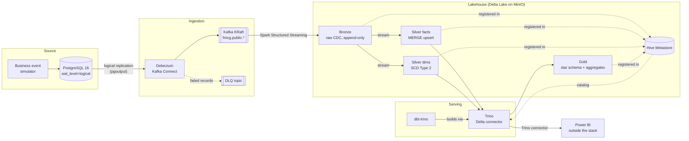

# fmcg-realtime-lakehouse

A near-real-time lakehouse for an FMCG distributor, built end to end on open-source components and run entirely with Docker Compose.

Orders, price changes, store tier upgrades and stock movements happen in a PostgreSQL OLTP database. Every change is captured with **Debezium CDC**, streamed through **Kafka**, landed by **Spark Structured Streaming** into **Delta Lake** on **MinIO**, modelled into **SCD Type 2** dimensions and current-state facts, turned into a star schema by **dbt on Trino**, and reported in **Power BI**. A change in Postgres reaches Silver within about a minute.

**What this project shows**

- CDC from a live OLTP system, including deletes, with ordering by commit LSN rather than wall-clock time
- A medallion architecture where Bronze is a replayable change log and Silver can be rebuilt without touching Kafka
- SCD Type 2 maintained in streaming, correct even when one micro-batch holds several changes to the same key
- Point-in-time joins in Gold: revenue reflects the price and store tier *at the time of sale*
- Idempotent, restart-safe streaming jobs (checkpoints + LSN-guarded MERGE)
- Reproducible everything: pinned images, one uv lockfile, deterministic seed data, one-command startup

> **Status:** under construction. See [docs/PROGRESS.md](docs/PROGRESS.md) for which phases are done.

## Architecture



| Layer | Storage | Written by | Contents |
|---|---|---|---|
| Source | PostgreSQL | Simulator | Normalised OLTP tables for an FMCG distributor |
| Raw events | Kafka | Debezium | One topic per table; unwrapped change events with `op`, `source.ts_ms`, `source.lsn` |
| Bronze | Delta on MinIO | Spark | Append-only raw CDC plus Kafka coordinates and ingest time. Replayable. |
| Silver | Delta on MinIO | Spark | Typed and deduplicated. Facts = current state (MERGE). Dimensions = SCD2 history. |
| Gold | Delta on MinIO | dbt via Trino | Star-schema marts and aggregates for BI |
| Serving | Trino → Power BI | — | SQL access; Power BI report on Gold |

More detail: [docs/architecture.md](docs/architecture.md) and the [architecture decision records](docs/adr/).

## Quickstart

Prerequisites: Docker with Compose v2.20+, [uv](https://docs.astral.sh/uv/), make and git. Power BI Desktop (Windows) for the report. Give Docker 12–16 GB of RAM for the full stack. On Windows, clone inside the WSL filesystem (e.g. `~/projects`), not under `/mnt/c`.

```bash
cp .env.example .env     # then change the passwords
uv sync                  # host tooling: ruff, sqlfluff, pytest, pre-commit
uv run pre-commit install
make demo                # starts every profile
make help                # all available targets
```

Bring the stack up one domain at a time with `make up P=<profile>`:

| Profile | Services |
|---|---|
| `source` | postgres, seed |
| `sim` | simulator |
| `kafka` | kafka, kafka-ui |
| `cdc` | kafka-connect, connector-register |
| `lake` | minio, minio-init, hms-db, hive-metastore |
| `streaming` | spark-bronze, spark-silver-facts, spark-silver-dims |
| `serving` | trino, dbt, dbt-scheduler |

`make down` stops everything and keeps data; `make nuke` also deletes all volumes.

## Ports

| Port | Service |
|---|---|
| 5432 | Postgres |
| 8080 | Kafka UI |
| 8083 | Kafka Connect REST |
| 9000 / 9001 | MinIO API / console |
| 4040–4042 | Spark UIs (bronze, silver facts, silver dims) |
| 8081 | Trino (also the Power BI data source) |

## Repository layout

```
compose/        one Compose file per domain, included by docker-compose.yml
infra/          configuration for third-party images (Postgres, Debezium, MinIO, HMS, Trino)
simulator/      seed loader + business event simulator (uv workspace member)
streaming/      Spark Bronze/Silver jobs (uv workspace member)
dbt/            dbt-trino Gold project (uv workspace member)
dashboards/     Power BI report, saved as a Power BI Project (.pbip) for version control
docs/           architecture, ADRs, progress log, runbook
```

## Tech stack

PostgreSQL 16 · Debezium · Apache Kafka (KRaft) · Spark 3.5 Structured Streaming · Delta Lake · MinIO · Hive Metastore · Trino · dbt · Power BI · Python 3.11 · uv · Docker Compose
