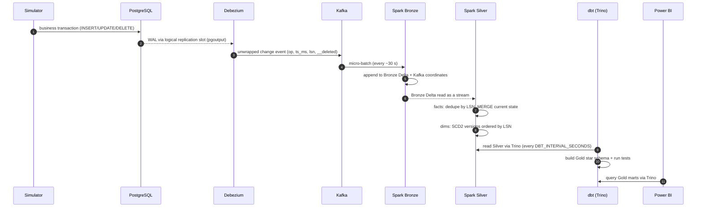

# Architecture

This document explains how data moves through the platform and why it is shaped this way. Individual decisions are recorded as ADRs in [adr/](adr/).

## 1. Data flow

## 2. Components

| Component | Role | Profile |
|---|---|---|
| PostgreSQL 16 | OLTP source; `wal_level=logical`, publication over the FMCG tables, dedicated replication user | `source` |
| seed (one-shot) | Deterministic master data + ~30 days of historical orders | `source` |
| simulator | Long-running "company applications" producing weighted business events | `sim` |
| Kafka (KRaft) | Durable event log, one topic per source table (`fmcg.public.<table>`) | `kafka` |
| Kafka UI | Topic and consumer inspection | `kafka` |
| Kafka Connect + Debezium | CDC from Postgres into Kafka; fails fast on errors (no source-side DLQ, see ADR-002) | `cdc` |
| MinIO | S3-compatible object storage for Delta tables and Spark checkpoints | `lake` |
| Hive Metastore | Shared table catalog for Spark and Trino | `lake` |
| spark-bronze | Kafka → Bronze Delta (append-only) | `streaming` |
| spark-silver-facts | Bronze → Silver facts (MERGE upsert, soft deletes) | `streaming` |
| spark-silver-dims | Bronze → Silver SCD Type 2 dimensions | `streaming` |
| Trino | SQL engine over Delta via the metastore | `serving` |
| dbt / dbt-scheduler | Gold models and tests; one-shot build and a periodic loop | `serving` |
| Power BI (external) | Report on Gold, connected to Trino; not part of the Compose stack | — |

## 3. Source domain

An FMCG distributor selling to retail outlets:

- **Dimensions (SCD Type 2):** `stores`, `products`, `sales_reps`. These change slowly but their history matters: price changes, tier upgrades, reps moving region.
- **Facts (current state):** `orders`, `order_items`, `inventory`.
- **Reference:** `regions`.

The seed is loaded once into Postgres. Debezium's initial snapshot (`snapshot.mode=initial`) then emits every existing row as `op='r'`, so the seed becomes the initial Bronze load without a separate batch path. After that, live changes stream from the WAL.

## 4. Two kinds of time

| | Business time | Change time |
|---|---|---|
| Example | `orders.order_ts` | Debezium `source.ts_ms`, `source.lsn` |
| Set by | The application (may be backdated) | The database at commit (cannot be faked) |
| Used for | Analytics: sales per day, revenue today vs. yesterday | Event ordering, deduplication, SCD2 `valid_from`/`valid_to` |
| Layer | Gold | Silver |

**Rule:** Silver ordering logic always uses the LSN. Gold analytics always uses business time. Point-in-time joins in Gold connect the two by finding the dimension version whose validity window contains the order's `order_ts`.

## 5. Medallion layers

### Bronze: raw and replayable
- One row per Kafka record: parsed payload, `op`, `source_ts_ms`, `source_lsn`, `is_deleted`, `kafka_topic`, `kafka_partition`, `kafka_offset`, `ingested_at`, partitioned by `ingest_date`.
- Append-only. `(kafka_topic, kafka_partition, kafka_offset)` is unique; checkpoints guarantee this across restarts.
- Malformed records go to a quarantine table instead of being dropped.

### Silver: typed and deduplicated
- Reads **Bronze Delta as a stream**, not Kafka ([ADR-003](adr/ADR-003-medallion-silver-reads-bronze.md)).
- **Facts:** per micro-batch, keep the latest event per primary key by LSN, then `MERGE` into the target, but only where the incoming LSN is newer than the stored one. Deletes set a soft-delete flag.
- **Dimensions (SCD2):** `row_hash` over tracked attributes suppresses no-op updates. Multiple changes to one key in a batch are ordered by LSN and each one becomes a version (`valid_to` comes from `lead()`). The open version is closed and the new versions are inserted in one `MERGE`.

### Gold: star schema
- `fct_sales` at order-line grain, point-in-time joined to `dim_store`, `dim_product`, `dim_sales_rep` and `dim_date`.
- Aggregates for BI: daily sales by region and brand, product price history, store tier movements.
- dbt tests cover keys, relationships, accepted values, and non-overlapping SCD2 windows.

## 6. Delivery guarantees

| Hop | Guarantee | Mechanism |
|---|---|---|
| Postgres → Kafka | At-least-once | Replication slot + Connect offsets; duplicates possible after a Connect crash |
| Kafka → Bronze | Exactly-once into Delta | Structured Streaming checkpoint + Delta transactional sink |
| Bronze → Silver | Effectively once | Checkpoint + MERGE guarded by LSN, which absorbs upstream duplicates and replays |
| Silver → Gold | Idempotent rebuild | dbt models are deterministic over Silver |

See [ADR-007](adr/ADR-007-idempotency.md).

## 7. Runtime and orchestration

- Docker Compose with one file per domain under `compose/`, included by the root file and gated by profiles ([ADR-008](adr/ADR-008-docker-compose-orchestration.md)).
- Startup ordering uses only `depends_on` conditions (`service_healthy`, `service_completed_successfully`), never sleeps.
- Each Spark streaming job runs in its own container in local mode. A crash means Compose restarts it, and it resumes from its checkpoint on MinIO.
- dbt runs on a simple loop (`dbt-scheduler`) as a lightweight stand-in for Airflow or Dagster.
- Python images are built from a single uv workspace lockfile ([ADR-009](adr/ADR-009-uv-packaging.md)).

## 8. Known limitations

- Debezium cannot see changes made before it started, so SCD2 history begins at the snapshot.
- JSON without embedded schemas: schema evolution is handled by hand in Spark. Avro + Schema Registry is the production path ([ADR-002](adr/ADR-002-debezium-unwrap-json.md)).
- Single-node Kafka and local-mode Spark: this is not highly available, and that is by design for a laptop.
